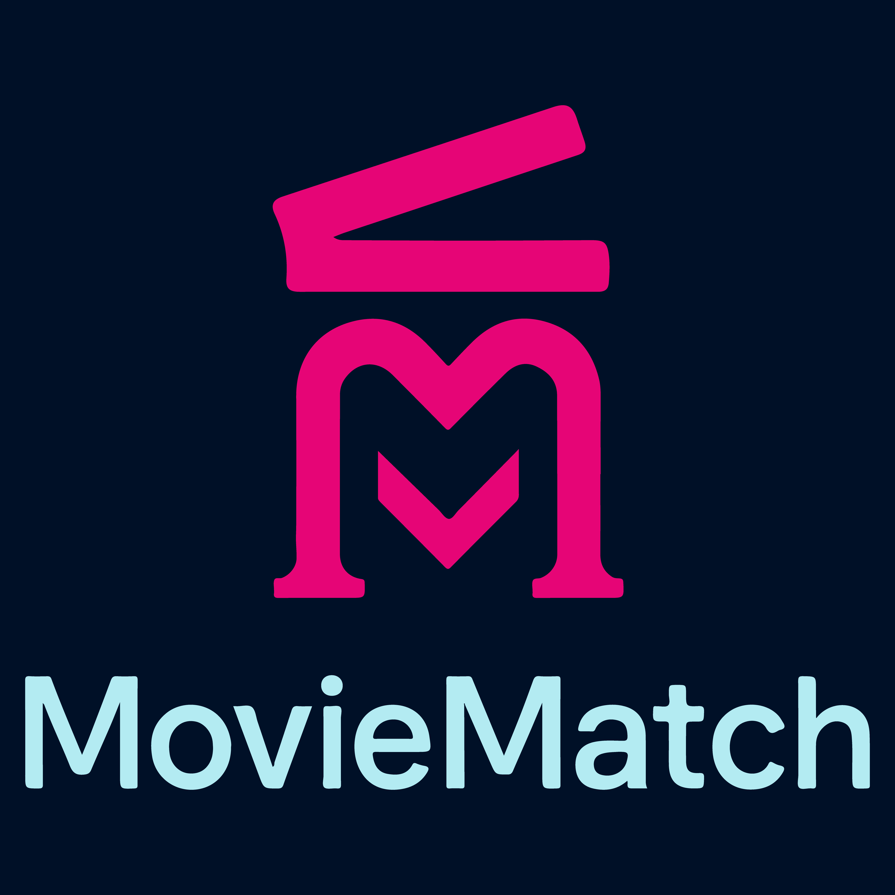

<div align="center" id="readme-top">
  

  <p align="center">
    <b>MovieMatch</b> es una herramienta inteligente potenciada por NLP que te ayuda a elegir la mejor película para ver en el cine, considerando tus gustos, tu compañía y tu estado de ánimo.
    <br />
    <em>“Elegir qué ver ya no será una discusión, será una experiencia compartida.”</em>
  </p>
  <a href="https://www.google.com"> Prueba MovieMatch </a>
</div>

<!-- TABLE OF CONTENTS -->
<details>
  <summary>Tabla de Contenidos</summary>
  <ol>
    <li><a href="#🔍-sobre-el-proyecto">🔍 Sobre el Proyecto</a></li>
    <li><a href="#🧠-cómo-funciona-el-algoritmo">🧠 Cómo Funciona el Algoritmo</a></li>
    <li><a href="#🔐-uso-de-clerk">🔐 Uso de Clerk</a></li>
    <li><a href="#🛠️-stack-tecnológico">🛠️ Stack Tecnológico</a></li>
    <li><a href="#🎯-empezando">🎯 Empezando</a>
      <ul>
        <li><a href="#prerrequisitos">Prerrequisitos</a></li>
        <li><a href="#instalación">Instalación</a></li>
      </ul>
    </li>
    <li><a href="#🚀-uso">🚀 Uso</a></li>
    <li><a href="#📸-capturas">📸 Capturas</a></li>
    <li><a href="#👥-equipo">👥 Equipo</a></li>
    <li><a href="#📌-consideraciones">📌 Consideraciones</a></li>
  </ol>
</details>

---

## 🔍 Sobre el Proyecto

**MovieMatch** nace para resolver un problema común: elegir una película para ir al cine con amigos, familia o pareja puede ser complicado. Las plataformas de streaming cuentan con algoritmos avanzados de recomendación, pero esta inteligencia aún no se aplica al cine presencial.

**MovieMatch** propone una solución: recomendar películas basándose en las características del grupo que asistirá, su estado de ánimo y sus gustos. Así, busca no solo mejorar la experiencia del espectador, sino también aportar al repoblamiento de las salas de cine con decisiones más acertadas y disfrute garantizado.

---

## 🧠 Cómo Funciona el Algoritmo

La lógica detrás de las recomendaciones utiliza técnicas de **Procesamiento de Lenguaje Natural (NLP)** y representación vectorial mediante **TF-IDF**, potenciado por **Google Gemini**. Los pasos clave del algoritmo incluyen:

- Recolección de características del grupo:
  - Género favorito por persona
  - Personalidad (2 emojis por asistente)
  - Tamaño del grupo
  - Tipo de salida (solo, pareja, amigos, familia)
  - Mood general del grupo
  - Comentarios adicionales

- Conversión de esas características a vectores numéricos
- Recolección de características de películas a través de la API TMDB
- Comparación con los datos de las peliculas a través de similitud de coseno
- **Generación de explicaciones naturales** usando Gemini AI
- Devuelve la opción más afín al grupo y contexto

> El algoritmo fue desarrollado en Python usando Flask y se expuso vía API.

---

## 🔐 Uso de Clerk

**Clerk** se utiliza para la autenticación de usuario, el sistema está preparado para:

- Autenticación segura
- Registro/login fluido
- Gestión de sesiones

Esto permite escalar el proyecto a futuro con perfiles personalizados y control de acceso para futuras funciones avanzadas.

---

## 🛠️ Stack Tecnológico

[![Next.js][Next.js]][Next-url]
[![Tailwind][TailwindCSS]][Tailwind-url]
[![Clerk][Clerk.js]][Clerk-url]
[![Node.js][Node.js]][Node-url]
[![Supabase][Supabase.js]][Supabase-url]
[![Python][Python.js]][Python-url]
[![Flask][Flask.js]][Flask-url]
[![Gemini][Gemini.js]][Gemini-url]

- **Frontend y Backend**
  - [Next.js](https://nextjs.org/)
  - [TailwindCSS](https://tailwindcss.com/)
  - [Clerk Auth](https://clerk.com/)
  - [Node.js](https://nodejs.org/)
<!-- - **Base de datos**
  - [Supabase](https://supabase.io/) -->
- **Recomendador**
  - [Python](https://www.python.org/) + NLP
  - [Flask](https://flask.palletsprojects.com/)
  - [Google Gemini](https://deepmind.google/technologies/gemini/)

<!-- Badges URLs -->
[Next.js]: https://img.shields.io/badge/Next.js-000000?style=for-the-badge&logo=nextdotjs&logoColor=white
[Next-url]: https://nextjs.org/
[TailwindCSS]: https://img.shields.io/badge/Tailwind_CSS-06B6D4?style=for-the-badge&logo=tailwind-css&logoColor=white
[Tailwind-url]: https://tailwindcss.com/
[Clerk.js]: https://img.shields.io/badge/Clerk-000000?style=for-the-badge&logo=clerk&logoColor=white
[Clerk-url]: https://clerk.com/
[Node.js]: https://img.shields.io/badge/Node.js-339933?style=for-the-badge&logo=nodedotjs&logoColor=white
[Node-url]: https://nodejs.org/
[Supabase.js]: https://img.shields.io/badge/Supabase-3ECF8E?style=for-the-badge&logo=supabase&logoColor=white
[Supabase-url]: https://supabase.io/
[Python.js]: https://img.shields.io/badge/Python-3776AB?style=for-the-badge&logo=python&logoColor=white
[Python-url]: https://www.python.org/
[Flask.js]: https://img.shields.io/badge/Flask-000000?style=for-the-badge&logo=flask&logoColor=white
[Flask-url]: https://flask.palletsprojects.com/
[Gemini.js]: https://img.shields.io/badge/Google_Gemini-4285F4?style=for-the-badge&logo=google&logoColor=white
[Gemini-url]: https://deepmind.google/technologies/gemini/

<p align="right">(<a href="#readme-top">volver arriba</a>)</p>

---

## 🎯 Empezando

### Prerrequisitos

Asegúrate de tener estas herramientas instaladas:

- [Node.js](https://nodejs.org/)
- [Python 3.10+](https://www.python.org/)
- [PNPM](https://pnpm.io/) (opcional, pero recomendado)
- [Git](https://git-scm.com/)
- Claves API para [TMDB](https://www.themoviedb.org/) y [Gemini](https://makersuite.google.com/)

### Instalación y Ejecución del Frontend

```bash
# Clona el repositorio
git clone https://github.com/Astra-exe/movie-match.git
cd movie-match

# Instala dependencias del frontend
pnpm install  # o npm install

# Corre la app en local
pnpm run dev      # o npm run dev
```

### Instalación y Ejecución del recomendador

```bash
# Clona el repositorio
git clone https://github.com/Astra-exe/movie-match.git
cd movie-match

# Instala dependencias usando requirements.txt
pip install requirements.txt

# Corre la app en local
py app.py      # o python app.py
```

<p align="right">(<a href="#readme-top">volver arriba</a>)</p>

---

## 🚀 Uso

1. **Ingresa a la plataforma y da click en "Comienza ahora".**
2. **Si aún no has iniciado sesión, hazlo para poder acceder a la herramienta.**  
3. **Ingresa las preferencias del grupo**:
   - Géneros favoritos
   - Estado de ánimo
   - Personalidad (emojis)
   - etc.
4. **Recibe una recomendación optimizada** con explicación generada por IA
5. *(Próximamente)* Guarda, comparte y etiqueta tus selecciones

---

## 📸 Capturas

> Por agregar

*(Se deja este espacio para capturas del flujo, recomendaciones y diseño del frontend)*

---

## 🎉 Agradecimientos

Este proyecto no sería posible sin:

- **The Movie Database (TMDB)** por su increíble API que nos permite acceder a los datos de películas en tiempo real.  
  *"Este producto utiliza la API de TMDB pero no está respaldado ni certificado por TMDB"*  
  📌 [Visitar TMDB](https://www.themoviedb.org/)

- **Midudev** por organizar este increíble hackathon que nos impulsó a crear MovieMatch.  
  🚀 [Ver otros proyectos del hackathon](https://github.com/midudev/hackaton-clerk-2025/issues)

- **Clerk** por proveer el sistema de autenticación que hace segura nuestra aplicación.  
  🔐 [Explorar Clerk](https://clerk.com)

*¡Gracias a toda la comunidad de desarrollo por las herramientas open source que hacen proyectos como este posibles!*

## 👥 Equipo

- [Juan Ramírez (Astra)](https://github.com/Astra-exe) – Data Science (NLP, ciencia de datos y algoritmo de recomendación ) 
- [Francisco Solís](https://github.com/francisco-solis99) – Fullstack developer (Frontend con Next.js, Node.js, Clerk, Supabase, integración)

---

## 📌 Consideraciones

- La precisión del algoritmo depende de la calidad de la entrada del usuario.
- Una afinidad del >40% se considera un resultado sólido para la preferencia de un grupo.
- Sistemas como Netflix o Spotify muestran recomendaciones con 60-80% de match para individuos, pero para grupos ese porcentaje suele ser menor por la diversidad.  
- Las explicaciones generadas por Gemini pueden variar según el contexto.   
- Clerk está listo para soportar autenticación robusta y escalamiento con roles.  

---

<div align="center">
  <h3>🎬 Gracias por usar MovieMatch 🎬</h3>
  <p>Elegir una película nunca fue tan fácil.</p>
</div>